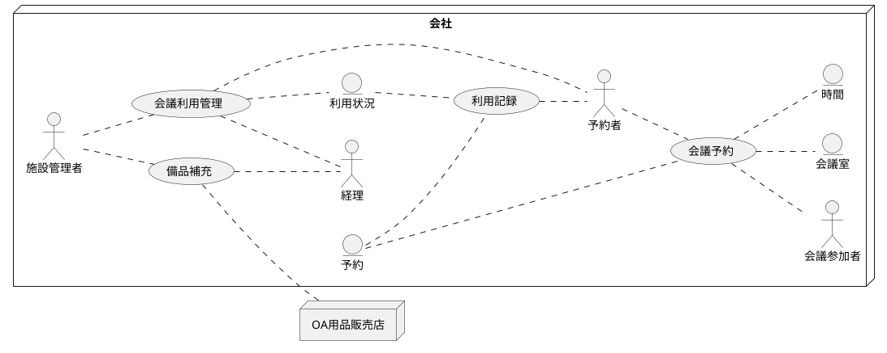

# ビジネスコンテスト
## 会議室予約

- 会議室の予約・キャンセルをする「会議予約」
- 会議室の実際の利用を記録する「利用記録」
- 記録された会議室の利用状況を確認する「会議利用管理」
- マーカーなど、備品の補充を行う「備品補充」

```puml

@startuml

left to right direction

node OA用品販売店
node 会社 {
    actor 予約者
    actor 会議参加者
    actor 施設管理者
    actor 経理

    entity 予約
    entity 会議室
    entity 時間

    entity 利用状況

    予約者 .. (会議予約)
    (会議予約) .. 会議参加者
    予約 .. (会議予約)
    (会議予約) .. 会議室
    (会議予約) .. 時間

    (利用記録) .. 予約者
    予約 .. (利用記録)
    利用状況 .. (利用記録)

    施設管理者 .. (会議利用管理)
    (会議利用管理) .. 利用状況
    (会議利用管理) .. 経理
    (会議利用管理) .. 予約者

    施設管理者 .. (備品補充)
    (備品補充) .. 経理
    (備品補充) .. OA用品販売店
}


@enduml
```