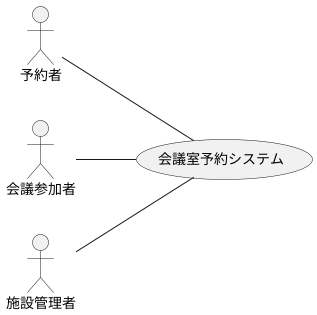

# システムコンテキスト

## システム化の目的

- 会議室をみだりに予約する事が多発しないよう、
- ルールに則ってしっかり管理が出来る状態
- 必要な会議のために、きちんと会議室が利用されている状態
- 会議室がどれだけ利用されているかが正しく把握できている状態
- 不足しているなら増設できるし、過剰なのであれば倉庫として活用するなどしたい

```puml
@startuml
left to right direction

actor 予約者
actor 会議参加者
actor 施設管理者

予約者 -- (会議室予約システム)
会議参加者 -- (会議室予約システム)
施設管理者 -- (会議室予約システム)
(会議室予約システム)

@enduml

```